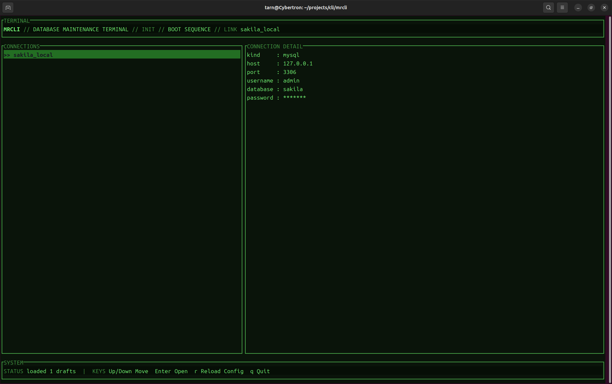
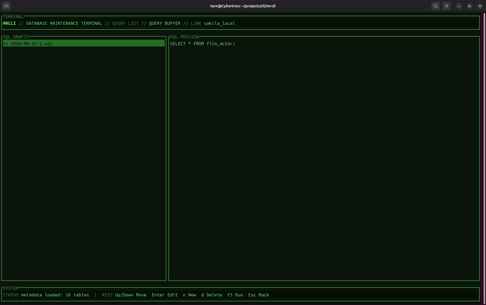
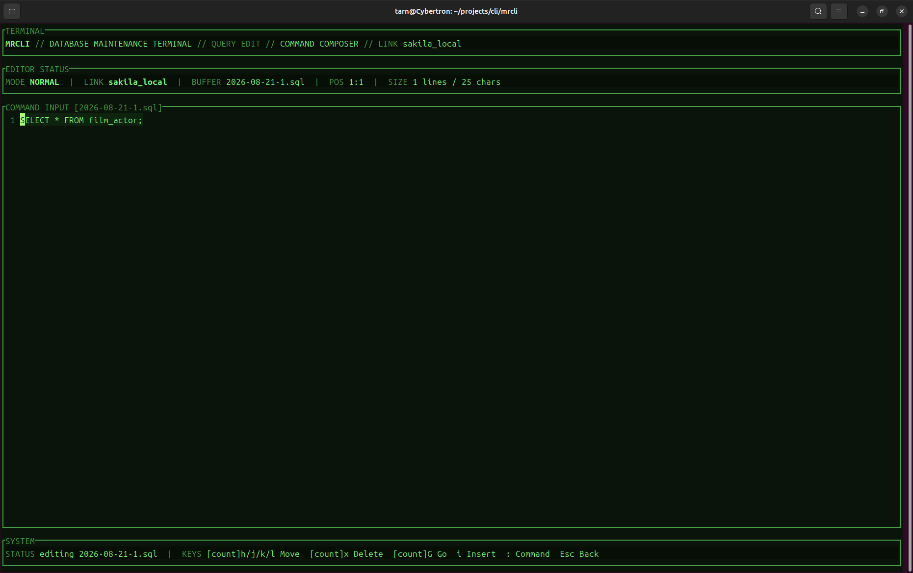
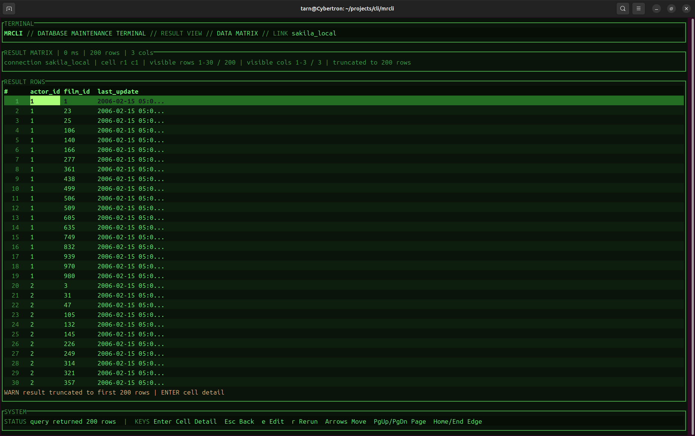

# MRCLI

MRCLI 是一个使用 Rust 编写的 MySQL 数据库维护终端。项目以《辐射》系列游戏中的哔哔小子终端为视觉主题，在终端中提供数据库连接管理、SQL 草稿编辑、SQL 执行和结果查看能力。

MRCLI 适合需要频繁编写和执行 SQL、又希望保持终端工作流的开发者和数据库维护人员。它不追求替代完整的数据库管理平台，而是提供一个轻量、键盘驱动、可保存 SQL 草稿的数据库工作区。

## 项目展示

### 首页



### SQL 草稿列表



### SQL 编辑器



### 查询结果



### 操作录屏

<video src="docs/screenshot/example_screenshot.mp4" controls></video>

如果当前 Markdown 查看器不支持内嵌视频，可以直接打开 [操作录屏](docs/screenshot/example_screenshot.mp4) 查看。

## 功能特性

- 支持 MySQL 数据库连接
- 从 `~/.config/mrcli/config.json` 加载连接配置
- 支持多个连接配置和默认连接选择
- SQL 草稿自动保存到 `~/.config/mrcli/drafts/`
- 草稿文件按照 `YYYY-MM-DD-N.sql` 命名
- 提供 `Normal`、`Insert` 和 `Command` 三种 Vim 风格编辑模式
- 支持 Vim count motion，例如 `10j`、`20l` 和 `3x`
- SQL 关键词在分隔符后自动标准化为大写
- 支持 SQL 关键词和常用函数补全
- 根据当前数据库元数据提供表名和列名补全
- 支持 `FROM`、`JOIN` 和 `table.` 上下文补全
- 数据库元数据在后台加载，不阻塞终端界面
- 支持查询结果表格浏览和单元格详情查看

## 技术栈

- Rust 2024 edition
- [Ratatui](https://ratatui.rs/)：终端用户界面
- [Crossterm](https://github.com/crossterm-rs/crossterm)：终端事件和屏幕控制
- [tui-textarea](https://github.com/rhysd/tui-textarea)：SQL 文本编辑
- [mysql](https://crates.io/crates/mysql)：MySQL 连接和查询
- Serde / JSON：配置文件解析

## 环境要求

- Rust stable toolchain
- Cargo
- 可访问的 MySQL 服务

检查 Rust 环境：

```bash
rustc --version
cargo --version
```

## 配置

创建配置文件 `~/.config/mrcli/config.json`：

```json
{
  "default_connection": "local_mysql",
  "connections": [
    {
      "name": "local_mysql",
      "kind": "mysql",
      "host": "127.0.0.1",
      "port": 3306,
      "username": "root",
      "password": "your-password",
      "database": "app_db"
    }
  ]
}
```

配置说明：

- `connections` 不能为空
- `name` 必须非空且唯一
- `kind` 当前必须为 `mysql`
- `host`、`username` 和 `database` 必须非空
- `port` 必须大于 `0`
- `default_connection` 可以为空；不存在时使用第一个连接
- 密码当前以明文保存在配置文件中，请注意配置文件权限和主机安全

## 构建和运行

在仓库根目录执行：

```bash
cargo run
```

构建发布版本：

```bash
cargo build --release
./target/release/mrcli
```

运行测试：

```bash
cargo test
```

部分数据库集成测试需要本地 MySQL 实例和测试数据库可用。

## 使用流程

1. 启动 MRCLI。
2. 在初始页面选择连接，按 `Enter` 进入 SQL 草稿列表。
3. 在草稿列表中打开已有草稿，或按 `n` 创建新草稿。
4. 按 `Enter` 打开选中的草稿。
5. 在编辑器中进入 `Insert` 模式并输入 SQL，按 `F5` 执行。
6. 在结果页面浏览查询结果，按 `Esc` 返回草稿列表，或按 `e` 返回编辑器。

## 快捷键

### 初始页面

| 按键 | 操作 |
| --- | --- |
| `Up` / `Down` | 选择连接 |
| `Enter` | 进入 SQL 草稿列表 |
| `r` | 重新加载配置 |
| `q` | 退出 |

### SQL 草稿列表

| 按键 | 操作 |
| --- | --- |
| `Up` / `Down` | 选择草稿 |
| `Enter` | 打开草稿 |
| `n` | 创建并打开新草稿 |
| `d` | 删除选中草稿 |
| `F5` | 执行选中草稿 |
| `Esc` | 返回连接页面 |
| `q` | 退出 |

### SQL 编辑器

编辑器默认进入 `Normal` 模式：

| 按键 | 操作 |
| --- | --- |
| `i` | 进入 Insert 模式 |
| `a` | 在光标后进入 Insert 模式 |
| `o` | 在当前行后新建一行并进入 Insert 模式 |
| `h` / `j` / `k` / `l` | 移动光标 |
| `x` | 删除光标位置的字符 |
| `:` | 进入 Command 模式 |
| `F5` | 保存并执行当前 SQL |
| `Esc` | 返回 SQL 草稿列表 |

在 `Insert` 模式中：

| 按键 | 操作 |
| --- | --- |
| `Esc` | 返回 Normal 模式 |
| `Ctrl+S` | 保存草稿 |
| `Ctrl+Space` | 打开 SQL 补全 |
| `Tab` / `Enter` | 接受当前补全候选 |
| `Up` / `Down` | 选择补全候选 |
| `Esc` | 关闭补全弹窗 |
| `F5` | 保存并执行当前 SQL |

在 `Command` 模式中支持以下命令：

```text
:w      保存草稿
:q      返回草稿列表
:wq     保存并返回草稿列表
:x      保存并返回草稿列表
:run    保存并执行 SQL
:q!     不保存并返回草稿列表
```

## SQL 智能补全

按 `Ctrl+Space` 可以手动打开补全。输入过程中，MRCLI 会根据光标前的 SQL 上下文刷新候选。

在 `FROM` 或 `JOIN` 后输入表名前缀：

```sql
SELECT * FROM ac
```

可以得到类似 `actor` 的表名候选。

在表名后输入 `.` 可以补全列名：

```sql
SELECT actor.fi
```

补全候选来自当前连接数据库的 `information_schema.tables` 和 `information_schema.columns`。元数据加载完成后，补全弹窗会显示表、列以及字段类型等信息。候选匹配不区分大小写，但插入编辑器时会保留数据库中的原始名称。

## 数据路径

| 内容 | 路径 |
| --- | --- |
| 配置文件 | `~/.config/mrcli/config.json` |
| SQL 草稿 | `~/.config/mrcli/drafts/` |
| 项目实施计划 | `docs/implementation-plan.md` |
| 项目截图和录屏 | `docs/screenshot/` |

## 项目结构

```text
src/
├── main.rs        # TUI 启动和主事件循环
├── app.rs         # 应用状态、事件处理和状态机
├── ui.rs          # 页面和组件渲染
├── model.rs       # 数据模型和应用状态
├── config.rs      # 配置加载和校验
├── drafts.rs      # SQL 草稿文件管理
├── db.rs          # MySQL 执行和元数据读取
└── completion.rs  # SQL、表名和列名补全
```

## 当前限制

当前版本主要面向 MySQL，暂不支持 PostgreSQL。元数据补全目前基于简单的 SQL 上下文判断，不是完整的 SQL 语法解析器。

以下功能暂未实现：

- PostgreSQL
- 手动输入连接
- 多语句执行
- 查询历史
- 执行取消
- 结果导出
- 多标签页
- SQL 语法高亮
- 复杂 SQL 语句和表别名的完整解析

## License

当前仓库尚未声明开源许可证。
